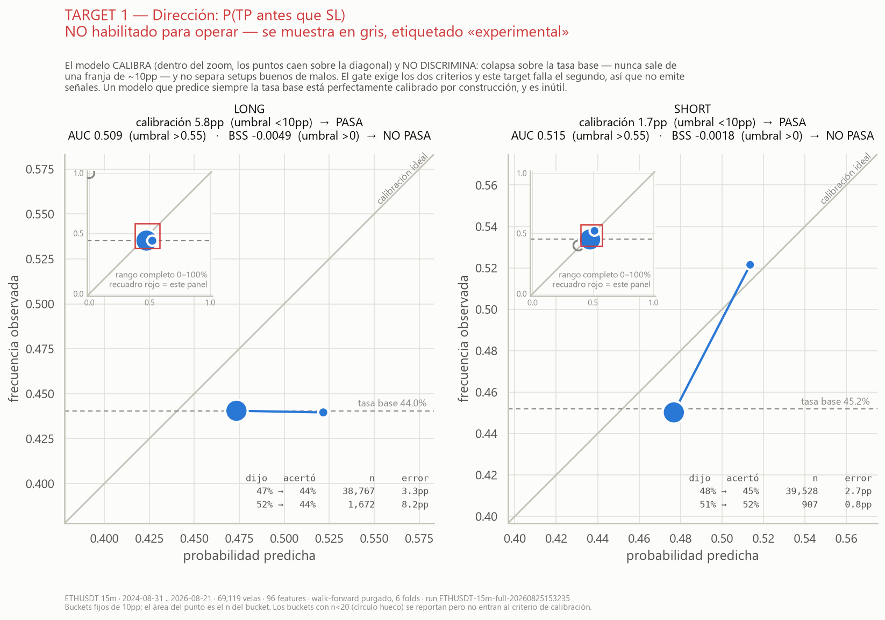
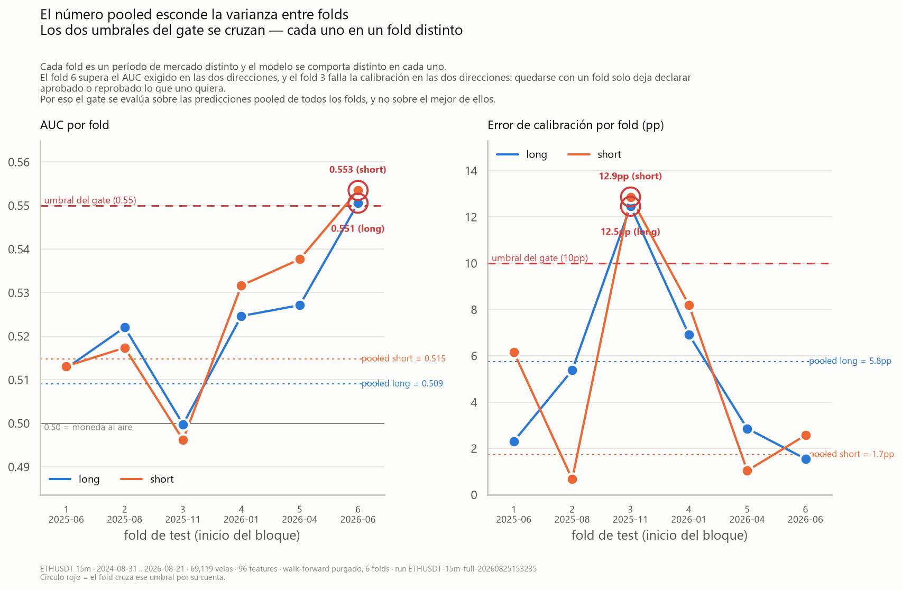
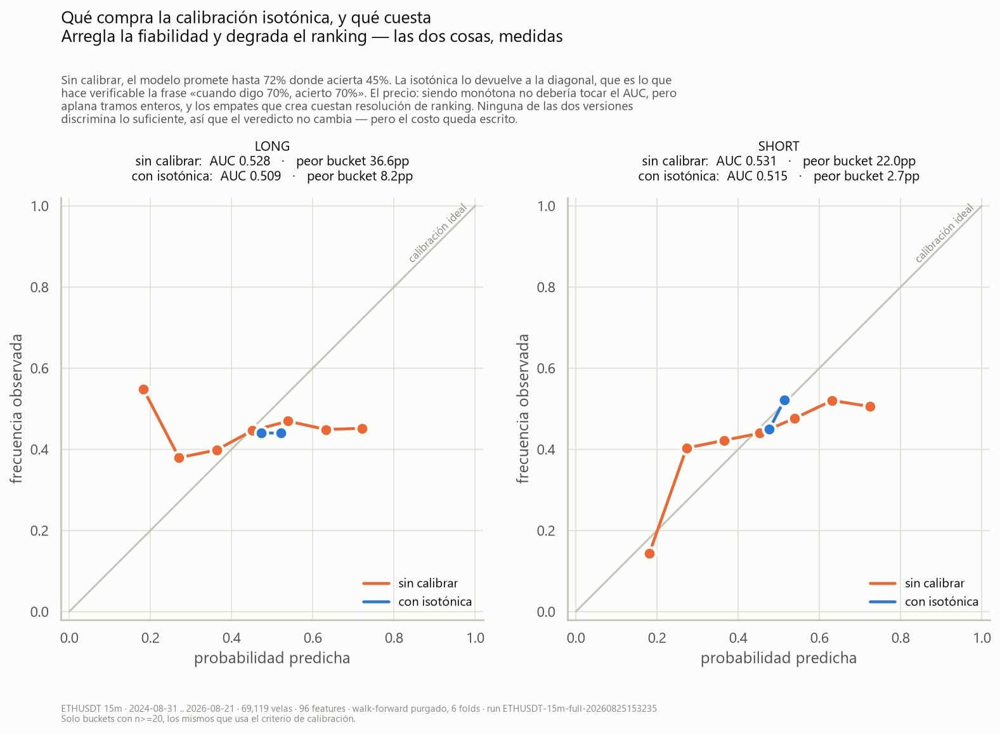
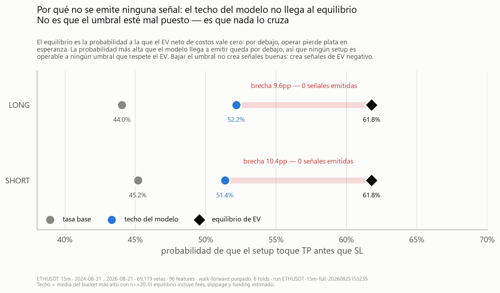
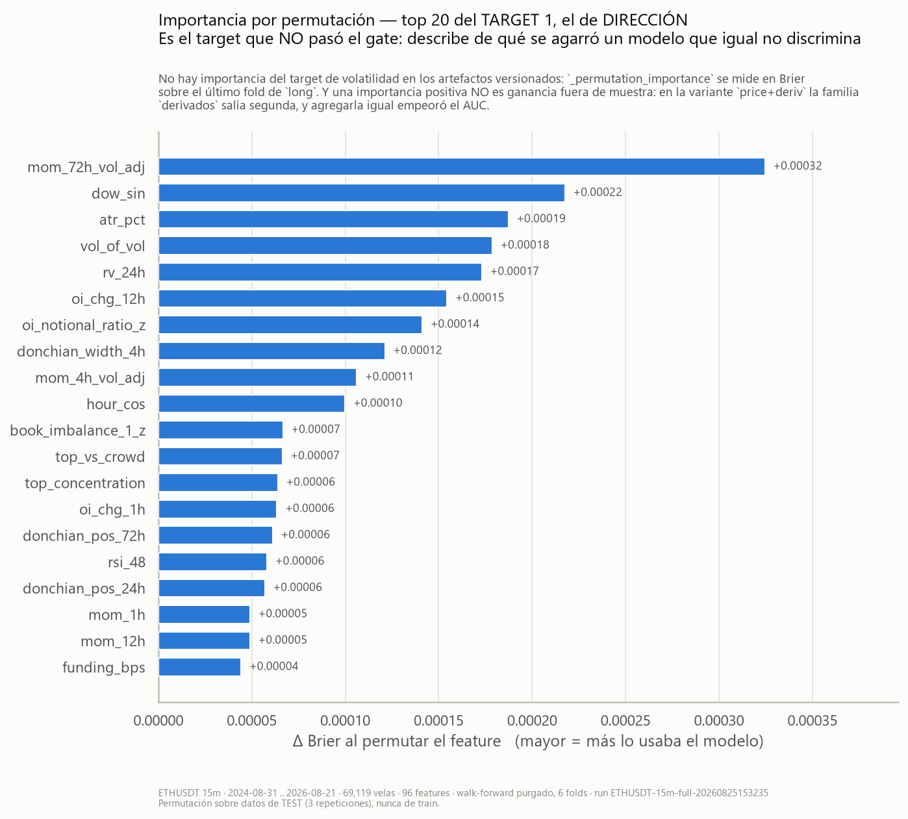
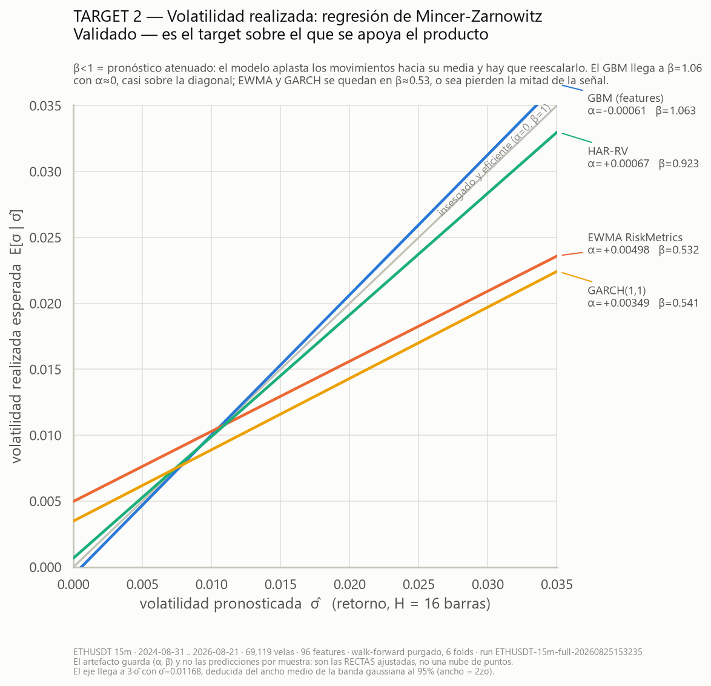
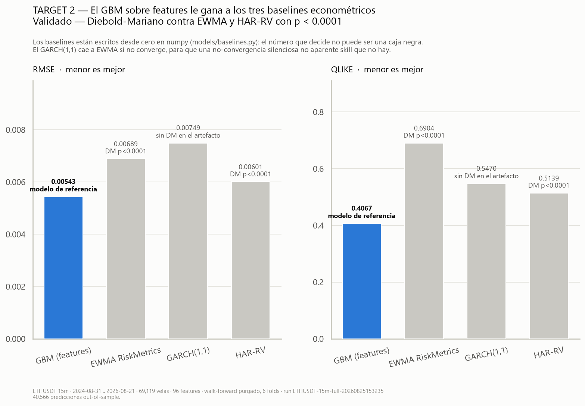
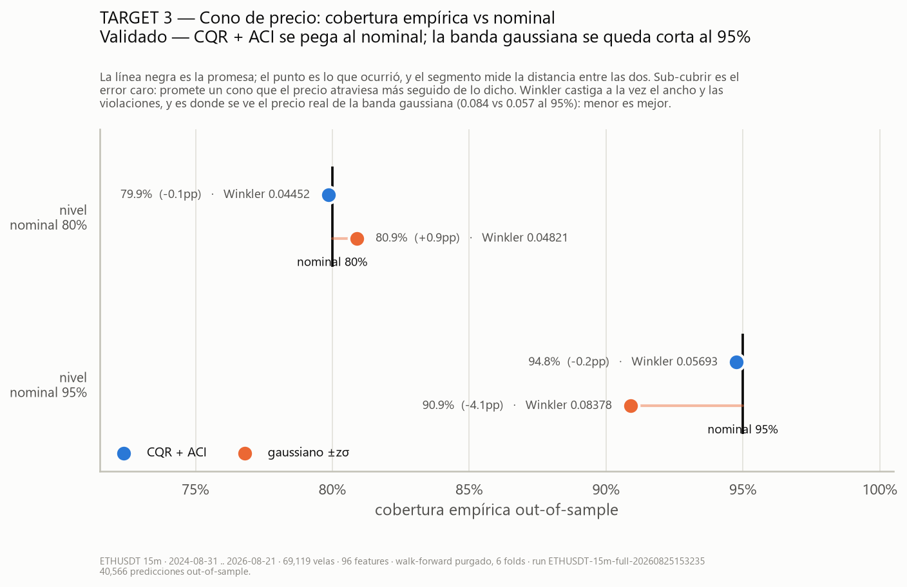
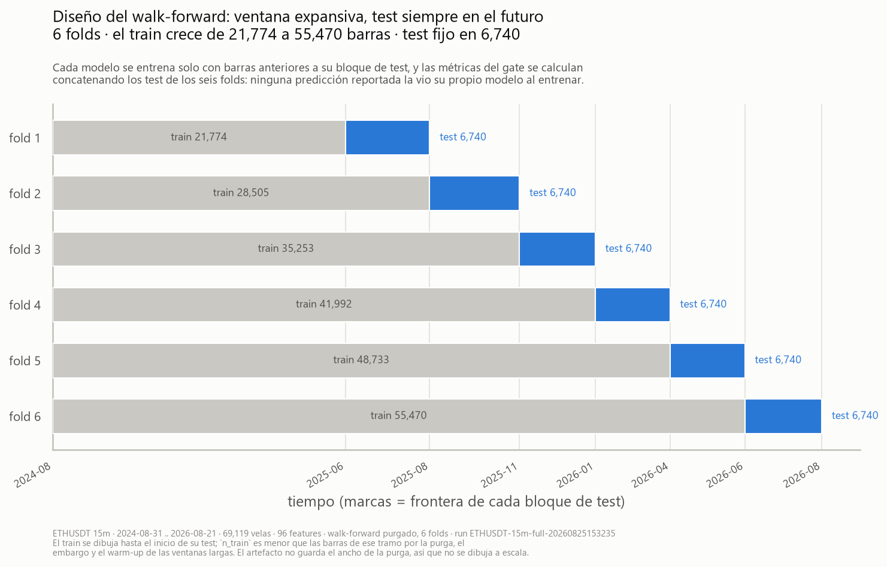
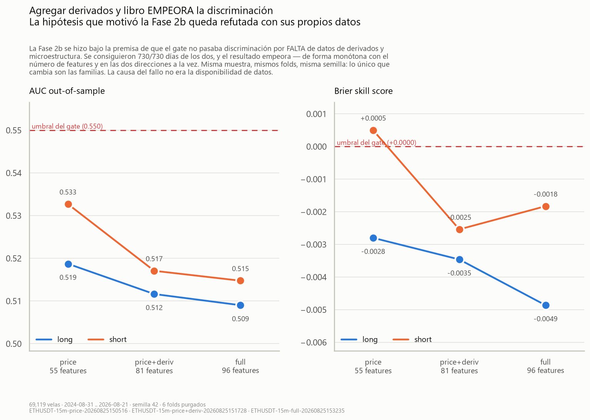

# BOB — Bursatil Operator Buddy

A decision assistant for **intraday perpetual-futures trading** on Binance.
BOB watches the market live, computes an advanced statistical state, and
tells the user — with probabilistic honesty — which scenario is the safest
and what the risk is. **BOB never places orders.**

Starting pair: `ETHUSDT` perp. The model is symbol-agnostic (configurable
watchlist).

> The previous build (a grid-trading bot for GRVT) is frozen on the
> `legacy/grvt-grid` branch.

> **Note on language.** This README is in English; the design documents under
> `docs/` and the project charter in `CLAUDE.md` are written in Spanish,
> which is the working language of the project. Section references from here
> point into those files.

---

## ⚠️ Gate verdict: what is validated and what is not

This project has a **two-criteria gate** that decides whether a probabilistic
KPI may be shown as tradeable. The result, measured and reproducible:

| Target | Gate | Status |
|---|---|---|
| **Direction** — `P(TP before SL)` | Calibrates (4.0pp / 5.1pp) but **does NOT discriminate** (AUC 0.519 / 0.533; BSS −0.0028 / +0.0005) | ❌ **Not enabled.** Shown greyed out, labelled "experimental". No directional signals are emitted. |
| **Future realized volatility** | OOS R² **+0.400** vs the mean and **+0.375** vs EWMA; QLIKE **0.3973** vs 0.6702 (EWMA), 0.5339 (GARCH(1,1)) and 0.5072 (HAR-RV); Diebold-Mariano against EWMA and HAR-RV at **p < 0.0001** | ✅ **Validated.** This is what the product rests on. |
| **Price cone** (CQR + ACI) | Empirical coverage 94.8% at 95% nominal (deviation −0.2pp) and 79.9% at 80% (−0.1pp) | ✅ **Validated.** |

**Both gate criteria are mandatory, not alternatives:**

1. **Calibration** — mean error < 10pp per bucket. It says *"when I say 70%,
   I'm right 70% of the time"*.
2. **Discrimination** — AUC > 0.55 **and** Brier Skill Score > 0. It says
   *"I know which cases are the 70% ones"*.

A model that always predicts the base rate is **perfectly calibrated by
construction** and useless. That is why passing only the first enables
nothing. The directional model passes the first and fails the second: **it
calibrates and does not discriminate.** That is not a bug — it is the
finding, and it is exactly what the weak form of the efficient-market
hypothesis predicts at this horizon.

### What this means for the product

By an explicit decision on 2026-08-25, **BOB is built on the volatility
target**, not the directional one. What it delivers:

- TP and SL **sized by the forecast sigma**, not by a fixed number
- **Liquidation price** and distance to liquidation in sigmas, per leverage
- **Maximum safe leverage**
- A price cone with verified coverage
- Net EV, always shown **next to its break-even probability** — as the bar to
  clear, not as a promise

There is one further result worth knowing before expecting positive EV: for a
driftless path with barriers at `+a` and `−b`, the probability of touching the
upper barrier first is `b/(a+b)`, and therefore gross EV is **exactly 0 for
every a and b** — net EV is `−cost`. Moving the TP or changing the R:B ratio
does not lift it: it reshuffles probability and payoff in exactly the
proportion that keeps the gross at zero. **Without a directional edge there is
no positive EV, and that is algebra, not markets.** Full derivation in
`docs/PROBABILITY_MODEL.md` §9-ter.3.

### How to verify it yourself

The reports for every run are **committed to the repo**, not summarized by
hand. The `GATE DE LA FASE 4` block sits at the end of each one:

```bash
cat backend/artifacts/ETHUSDT-15m-price-20260825150516.txt
cat backend/artifacts/ETHUSDT-15m-price+deriv-20260825151728.txt
cat backend/artifacts/ETHUSDT-15m-full-20260825153235.txt

# The estimator benchmark for the volatility target (2026-08-26)
cat backend/artifacts/ETHUSDT-15m-price-gbm-20260826135740.txt
cat backend/artifacts/ETHUSDT-15m-price-xgb-20260826140451.txt

# The variant comparator, which imports the gate thresholds from
# ExperimentResult itself instead of copying them
cd backend && uv run python -m bob.backtest.compare
```

And to reproduce from scratch (data download + experiment). All randomness in
a run flows through a single `seed` in `ExperimentConfig`, fixed at 42, so two
runs over **the same bars** produce reports that are identical line by line
except for the runtime and the run id:

```bash
cd backend
uv run python -m bob.data.download --symbol ETHUSDT --timeframe 15m --months 24
uv run python -m bob.data.download_vision --symbol ETHUSDT --timeframe 15m --days 730
uv run python -m bob.backtest.runner --symbol ETHUSDT --timeframe 15m --folds 6 --features price
```

**`--until` is what makes an old run reproducible**, and it is not optional
for that purpose. The database grows on its own while the live feed runs, and
`load_series` reads whatever is in it, so the same command run on two
different days trains on two different samples — the reproducibility control
degrades silently, with nothing failing. Reproducing a run means naming its
last bar, which is precisely what its report prints:

```bash
# reproduces the run of 2026-08-25 exactly: same 69,119 bars
uv run python -m bob.backtest.runner --features price --vol-model gbm     --until 2026-08-21T20:30
```

Minute precision matters here rather than being pedantry: that run ended on
the 20:30 bar of a day the database later filled out to 23:45. Cutting by
calendar date alone leaves 13 extra bars — enough to move the calibration
error of the short direction from 5.1pp to 10.3pp.

Verified, not merely claimed: with that cut, the run of 2026-08-26 reproduces
the artifact of 2026-08-25 **bit for bit** (AUC 0.518701 / 0.532680, BSS
−0.002801 / +0.000498, volatility RMSE 0.00558709, QLIKE 0.39626506) across
the XGBoost refactor in between.

### Two boosting implementations, one number

The volatility estimator can be run as scikit-learn's
`HistGradientBoostingRegressor` (`--vol-model gbm`, the default and what the
Phase 4 gate ran) or as **XGBoost** with the same hyperparameters
(`--vol-model xgb`). Both were run over the same 69,498 bars, same folds, same
seed:

| Feature set | Estimator | RMSE | QLIKE | R² vs mean | DM vs EWMA / HAR |
|---|---|---|---|---|---|
| `price` | sklearn GBM | 0.00559 | 0.3974 | +0.399 | p<0.0001 / p<0.0001 |
| `price` | **XGBoost** | 0.00559 | **0.3973** | **+0.400** | p<0.0001 / p<0.0001 |
| `price+deriv` | **sklearn GBM** | **0.00568** | **0.4098** | **+0.391** | p<0.0001 / p<0.0001 |
| `price+deriv` | XGBoost | 0.00570 | 0.4160 | +0.388 | p<0.0001 / p<0.0001 |

**The result is a tie**, and the tie is the finding: with identical
hyperparameters, two competent histogram-boosting implementations land within
0.3% of each other, and which one wins flips with the feature set. The edge
over the baselines comes from the features and the target design, not from the
library. The default stays on sklearn — there is no measured reason to move
it, and it is the estimator the gate ran with.

A useful invariant fell out of it: the direction target (Target 1) is
**bit-for-bit identical** across the two, in both feature sets. It should be —
`vol_kind` touches only Target 2 — and now that is measured rather than
assumed.

Two implementation notes worth keeping:

* The hyperparameter translation is not literal. `max_leaf_nodes` becomes
  `max_leaves`, which XGBoost honours only under `grow_policy="lossguide"`
  (its default grows by depth), and `min_samples_leaf` becomes
  `min_child_weight`, which is the sum of leaf hessians — equal to the sample
  count under squared loss, and *not* equal under any other loss.
* `assert_columns_trainable` stops being an error translator and becomes the
  only protection. Measured on the same matrix: sklearn raises `ValueError`
  when a column has no finite value in the training window, **XGBoost fits and
  predicts without saying anything**. The loud failure goes quiet, and the run
  would finish green reporting metrics for a model that learned from an empty
  column.

### The ablation that refuted the working hypothesis

Phase 2b was carried out under the premise that the gate failed
discrimination *because derivatives and microstructure data were missing*.
730/730 days of both were obtained. The result, with the same seed and the
same folds:

| variant | features | AUC long | AUC short | BSS long | BSS short | verdict |
|---|---|---|---|---|---|---|
| `price` | 55 | 0.519 | 0.533 | −0.0028 | +0.0005 | ✗ not enabled |
| `price+deriv` | 81 | 0.512 | 0.517 | −0.0035 | −0.0025 | ✗ not enabled |
| `full` | 96 | 0.509 | 0.515 | −0.0049 | −0.0018 | ✗ not enabled |

**The new families make discrimination worse**, monotonically in the number of
features and in both directions at once. The premise was false, and it is
written down that it was. A telling detail: in `price+deriv` the `derivados`
family scores 0.00151 in permutation importance (second place) — so the model
**does** use them — but in `full` it drops to 0.00006 and `libro` comes out
negative. **Positive permutation importance ≠ out-of-sample gain.**

The volatility target, by contrast, holds up across all three variants
(R² vs the mean: 0.400 / 0.392 / 0.405).

---

## Results and diagnostics

The figures below are **drawn from the committed artifact**
`backend/artifacts/ETHUSDT-15m-full-20260825153235.json` — the `full` run,
96 features, 69,119 bars — and nothing is recomputed to produce them. Regenerate
them from the same file at any time:

```bash
cd backend
uv pip install -e ".[viz]"                   # optional group; NOT a core dependency

# One run -> 9 PNG + 1 interactive HTML, each suffixed with the run's variant
uv run python scripts/plot_diagnostics.py \
    artifacts/ETHUSDT-15m-full-20260825153235.json

# The cross-run ablation figure, naming the runs to compare explicitly
uv run python scripts/plot_diagnostics.py \
    artifacts/ETHUSDT-15m-full-20260825153235.json \
    --ablation artifacts/ETHUSDT-15m-price-20260825150516.json \
               artifacts/ETHUSDT-15m-price+deriv-20260825151728.json \
               artifacts/ETHUSDT-15m-full-20260825153235.json
```

Four properties are what make these figures evidence rather than decoration:

- The script reads only the artifact and **fails naming the missing field**
  rather than drawing an empty chart.
- Every figure carries its **run id, date range and sample count** in the
  footer, and its filename carries the variant — two runs never overwrite each
  other, and no figure is ambiguous about which run produced it.
- Captions that make a claim about the data **derive it from the data**. The
  fold-stability subtitle, for one, states which folds cross which threshold by
  measuring it, so it stays true when pointed at a different run.
- `--ablation` **refuses to compare runs** that differ in sample, seed, folds or
  barriers. Runs over different samples are not an ablation, and that
  degradation is otherwise silent.

The same figures exist for the `price+deriv` run (81 features — the variant that
runs live) under the `_price-deriv` suffix.

### The directional target — ❌ did not pass the gate



Predicted probability vs observed frequency, per 10pp bucket, for both
directions. **The model calibrates and does not discriminate**: the points sit
on the diagonal (calibration error 5.8pp long / 1.7pp short, under the 10pp
threshold) but they never leave a narrow band around the base rate — AUC 0.509
and 0.515 against a threshold of 0.55, with negative BSS. The inset shows the
full 0–100% range, which is where the collapse is visible. **The gate requires
both criteria, so this target is not enabled**: it is displayed greyed out and
labelled "experimental", and BOB emits no directional signals from it. Buckets
with n<20 (hollow circle) are reported but excluded from the criterion.



**What the pooled number hides.** AUC and calibration error fold by fold. The
spread straddles both gate thresholds: fold 6 (Jun–Aug 2026) clears AUC 0.55 in
*both* directions, and fold 3 (Nov 2025–Jan 2026) fails the 10pp calibration
bound in *both*. Keeping the last fold alone would let you declare the gate
passed; keeping fold 3 alone would let you declare calibration failed. That the
two directions move together says this is a period effect and not noise in one
of them — and it is why the gate is evaluated on the pooled out-of-sample
predictions of all folds rather than on the best one.



**What isotonic calibration buys and what it costs — both measured.**
Uncalibrated, the model promises up to 72% where it hits 45%, worst bucket
36.6pp. Isotonic pulls it back onto the diagonal, which is what makes "when I
say 70%, I'm right 70%" verifiable. The price: being a monotone transform it
should not touch AUC, but it flattens whole segments, and the ties that creates
cost ranking resolution — 0.528 → 0.509 long, 0.531 → 0.515 short. Neither
version discriminates enough, so the verdict does not change; the cost goes on
the record anyway.



**Why zero signals are emitted.** Break-even — the probability at which EV net
of fees, slippage and funding is zero — sits at 61.8%. The highest probability
the model ever emits is 52.2% long and 51.4% short, leaving a gap of about 10pp.
No setup is tradeable at any threshold that respects EV, and lowering the
threshold does not create good signals: it creates negative-EV ones.



Top 20 features by permutation importance — **also the directional target**
(Δ Brier over the last `long` fold), not the volatility one: the committed
artifacts contain no permutation importance for the volatility target, and
labelling this figure as such would credit the target that passed with the
evidence of the one that did not. It describes what a model that still fails to
discriminate was leaning on, and it is the same trap as the ablation above:
positive permutation importance is not out-of-sample gain.

### The volatility target and the cone — ✅ validated



Mincer-Zarnowitz: the fitted α (bias) and β (efficiency) of each model. The GBM
lands at α≈0 with β=1.06, essentially on the diagonal; EWMA and GARCH stay at
β≈0.53, attenuating more than half the signal. These are the **fitted
regression lines**, not a scatter — the artifact stores (α, β), not per-sample
predictions, and drawing a point cloud would be inventing one.



RMSE and QLIKE against the three baselines, with the Diebold-Mariano p-values
annotated. The GBM wins on both metrics, with **p < 0.0001 against EWMA and
HAR-RV**. DM against GARCH was not run in this experiment, and the bar says so
instead of leaving the gap silent. An interactive version with per-model hover
detail is at [`baselines_volatility_full.html`](docs/figures/baselines_volatility_full.html)
(self-contained, ~4 MB — open it locally; GitHub will not render it inline).



Empirical coverage of the price cone against the nominal level. **CQR + ACI
tracks the nominal to within 0.2pp** at both levels; the Gaussian ±zσ band
under-covers by 4.1pp at 95%, which is the expensive error — it promises a cone
the price crosses more often than stated — and its Winkler score (0.084 vs
0.057) prices that in.

### Method, and the ablation



The validation design itself: an expanding training window (21,774 → 55,470
bars) against a fixed 6,740-bar test block that is always in the future. Every
model sees only bars earlier than its own test block, and the gate metrics
concatenate the six test blocks — no reported prediction was seen at training
time by the model that made it. The purge and the embargo are not drawn to
scale: the artifact does not store their width, and the footer says so.



**The ablation that refuted the Phase 2b hypothesis**, over the same sample, the
same folds and the same seed — the only thing that changes is the feature
families. AUC falls monotonically with the feature count in both directions, and
BSS with it. Phase 2b was carried out on the premise that discrimination failed
for *lack* of derivatives and microstructure data; 730/730 days of both were
obtained and the result got slightly worse. The cause of the failure was not
data availability.

---

## How the models are implemented

An explicit design decision: **the econometric baselines and the inference
engine are written from scratch in numpy**, not imported from a library. The
backtest and the calibration are the reason this project exists; a baseline
you cannot audit line by line is no basis for deciding whether the model adds
anything.

| Component | Implementation | Dependency |
|---|---|---|
| **GARCH(1,1)**, Gaussian QMLE | Own — hand-written likelihood, numerical rescaling, falls back to EWMA if it fails to converge | numpy + `scipy.optimize.minimize` (L-BFGS-B) |
| **HAR-RV** (Corsi 2009) | Own — OLS on log-volatility with the Jensen correction `exp(µ+σ²/2)` | numpy (`np.linalg.lstsq`) |
| **EWMA / RiskMetrics** (λ=0.94) | Own | numpy |
| Random walk, base rate | Own | numpy |
| **Gaussian HMM** — Baum-Welch, forward-backward with Rabiner scaling, n selected by BIC/ICL | Own (~80 lines of EM) | numpy; `sklearn.cluster.KMeans` **only** to initialize |
| **Metrics** — Brier, BSS, ECE, QLIKE, Winkler, Mincer-Zarnowitz | Own | numpy |
| **Diebold-Mariano** with the Harvey-Leybourne-Newbold correction | Own | `scipy.stats` only for Student's t |
| Triple-barrier, purged walk-forward + embargo, uniqueness weights | Own | numpy |
| Conformal CQR + ACI | Own | numpy |
| GBM, logistic regression, Ridge, isotonic, StandardScaler | **scikit-learn** | scikit-learn |
| Volatility estimator, alternative — same hyperparameters, selected with `--vol-model xgb` | **XGBoost** | xgboost |

**Neither `statsmodels` nor `arch` is used.** They are not in
`backend/pyproject.toml` nor in the environment. Nor is `hmmlearn`: beyond not
shipping a wheel for this environment's Python, its inference **is unusable as
a feature** — `predict` is Viterbi over the complete sequence and
`predict_proba` is the smoothed posterior, and both look at each bar's future.
That is precisely the lookahead this project forbids, and the bug would be
invisible: the backtest would produce beautiful metrics that do not reproduce
live. The causal filter had to be written anyway; all the library added was
Baum-Welch.

No all-in-one trading libraries either (freqtrade, backtrader, jesse): the
backtest is our own because calibration error is the number that decides.

---

## Requirements

- Python 3.11+ and [uv](https://docs.astral.sh/uv/)
- Node.js 18+ with npm

## Setup

```bash
# 1. (Optional) configure the environment — the backend boots without .env
cp .env.example backend/.env

# 2. Backend
cd backend
uv sync --extra dev
uv run python -m uvicorn bob.main:app --reload
# → http://localhost:8000/api/health

# 3. Frontend (another terminal)
cd frontend
npm install
npm run dev
# → http://localhost:5173
```

> ⚠️ Always invoke entry points as `uv run python -m <module>`. On Windows,
> `uv run uvicorn ...` (and `uv run pytest`) fails with
> `uv trampoline failed to canonicalize script path`.

`GET /api/health` reports the state of the feed **and of the analyst**
(whether it is fitted, whether it is refitting, the last forecast emitted,
cone coverage). During a long run the question that matters is not "is the
backend responding?" but "is the analyst emitting?", and those are different
things.

To work offline (without touching Binance): `BOB_LIVE_DATA=false`.

---

## Forecasting pipeline

BOB **does not forecast the price level**. Predicting `close[t+H]` yields
R² ≈ 0.99 and means nothing: the model learns to copy the last price with a
lag. The stack predicts three things that *are* predictable:

| Target | Type | Feeds | Gate |
|---|---|---|---|
| `P(TP before SL)` | Calibrated binary classification | KPI 1 — Safety | ❌ fails |
| Future realized volatility | Regression | TP/SL sizing, KPI 2 | ✅ passes |
| Return interval over H bars | Conformal prediction (CQR + ACI) | Price cone | ✅ passes |

Everything is validated with **purged walk-forward with embargo**
(triple-barrier labels overlap; a standard K-Fold leaks the future and comes
out inflated), against real baselines, and with a **Diebold-Mariano** test to
tell whether the difference is distinguishable from luck.

### Data

No Binance market data requires an API key. BOB has no trading credentials and
needs none — consistent with "never places orders".

| Source | What it gives | Persisted |
|---|---|---|
| Binance Futures WS | klines, trades, depth, markPrice — latency <100ms | live |
| Binance Futures REST | kline and funding history, OI and ratios for ~30 days | 69,119 15m candles (720 days, 0 gaps) |
| **data.binance.vision** | static daily archive: OI, long/short ratios, taker ratio (5m grid since 2021-12) and book depth (since 2023-01) | metrics 210,232 rows · bookDepth 70,074 rows · **730/730 days, 0 gaps** |

**104 features** in total: 55 price + 26 derivatives + 23 order book. Of the
book features, 8 are *near-touch* (the ±0.2% level) and are NaN before
2026-01-15, which is when Binance started publishing that level — they carry
an explicit mask; they are not imputed.

A Phase 1 finding worth recording: the mainnet futures WS is **not blocked**.
Binance silences specific streams while delivering others over the same TLS
connection (silent: `@aggTrade`, `@kline_*`, `@markPrice`, `@ticker`; live:
`@trade`, `@bookTicker`, `@depth*`). Taker flow is sustained with `@trade`,
verified identical to the official REST data (0.000% volume difference), and
`kline`/`markPrice` are backfilled over REST in parallel. Details in
`docs/DATA_SOURCES.md`.

---

## Live operation and paper tracking

```bash
cd backend
uv run python -m uvicorn bob.main:app     # the initial fit takes ~83s, in the background
uv run python -m bob.paper.tracker --symbol ETHUSDT   # resolves what is mature, prints coverage
```

Step-by-step procedure for the validation run — start, check it is alive,
pause, resume, and what to do when something breaks:
**`docs/RUNBOOK_FASE5.md`** (Spanish), verified command by command against a
real backend.

Every closed candle produces a forecast (`analysis.forecast` over WS, plus a
`ForecastRecord` row in SQLite carrying the **complete feature vector**). The
tracker resolves it once its horizon closes — realized sigma, cone coverage,
realized EV — using **the same metric functions as the gate**, so that
"forward vs backtest" is a comparison and not a translation.

**Pausing the process is safe.** You do not need 72 uninterrupted hours: what
is needed is ~280 resolved forecasts, and everything that matters lives in
SQLite. The analyst repairs the candle and derivatives series on startup.

| | survives powering the machine off? |
|---|---|
| Emitted forecasts with their full feature vector | ✅ they are in `ForecastRecord` |
| Resolved outcomes and the coverage report | ✅ recomputed from the DB |
| ACI state (`alpha_t`, cumulative coverage) | ✅ **derived** from the resolved records via `replay_cone_state` |
| Candles and derivatives from the downtime range | ✅ the analyst repairs them on startup |
| Bars that happened while the process was down | ❌ those are never forecast |

Two warnings that do not depend on the software: derivatives snapshots recover
**~41h per request** and Binance's window is ~30 days, so a pause longer than
~41h leaves an **unrecoverable** derivatives gap. And the machine going to
sleep counts as a pause.

Live, the default is `price+deriv`, not `full`: `bookDepth` comes from the
daily archive (~1 day of lag) and the join is exact on `open_time`, with no
forward-fill — filling it would be inventing liquidity. `assert_tail_observable`
fails naming the columns instead of leaving the analyst silently mute.

---

## Tests

```bash
cd backend
uv run python -m pytest      # do NOT use `uv run pytest` on Windows (trampoline bug)

# With coverage of the pure layers
uv run python -m pytest --cov=bob.signals --cov=bob.models --cov=bob.backtest --cov=bob.data
```

**699 tests green.** Coverage ≥ 90% in `signals/`, `models/` and `backtest/` —
a bug there is a false probability applied to leveraged capital.

Two tests hold up the invariants that, if broken, corrupt everything silently
(because the results come out **better**, not worse):

- `test_mutar_el_futuro_no_altera_el_pasado` — no lookahead.
- `test_escalar_el_precio_no_cambia_los_features` — dimensionless features,
  which is what makes the engine symbol-agnostic.

---

## Status by phase

| Phase | What | Status |
|---|---|---|
| 0 | Skeleton migration | ✅ |
| 1 | Binance data pipeline (WS + REST + store + CLI) | ✅ |
| 2 | Pure feature engine — 55 price features | ✅ |
| 2b | Derivatives + microstructure over 730 days, venue profiles | ✅ |
| 3 | Pure models — HMM, triple-barrier, conformal, projection | ✅ |
| 4 | Backtesting engine — **the gate** (run twice) | ✅ run · ❌ direction not enabled |
| 5 | Live + paper tracking of the projection | ✅ built · ⏳ accumulating samples |
| 6 | API + dashboard | ⬜ |
| 7 | Telegram alerts + sentiment | ⬜ |
| 8 | Outliers Club + multi-symbol | ⬜ |
| 9 | End-to-end validation | ⬜ |

---

## Documentation

All design documents are in Spanish, the working language of the project.

- `CLAUDE.md` — identity, architecture, KPIs, phases and project rules
- `docs/PROBABILITY_MODEL.md` — derivation of the forecasting stack, the gate
  and its results, with the discarded alternatives and the known limits
- `docs/DATA_SOURCES.md` — Binance/CoinGecko/etc. endpoints and their traps
- `docs/RUNBOOK_FASE5.md` — how to run the forward validation run
- `docs/HANDOFF_FASE1.md` — state at the close of Phase 0 and environment gotchas
- `backend/artifacts/*.txt` — the gate reports, committed
- `docs/figures/` — the diagnostic figures, regenerated from those artifacts
  by `backend/scripts/plot_diagnostics.py`

## Non-negotiable rules

1. **BOB never places orders.** There is no execution code on `main`. Period.
2. **No probabilistic KPI is shown as tradeable without demonstrated
   calibration AND discrimination.** Greyed out and "experimental" until then.
3. **Layer purity**: `signals/`, `models/` and `backtest/` do no I/O.
4. **No lookahead.** Any feature or label that uses information from the
   future relative to its timestamp is a critical bug, and the tests must
   catch it.
5. **Do not inflate the KPI**: no rounding up, no smoothing drawdowns, no
   hiding bad buckets.
